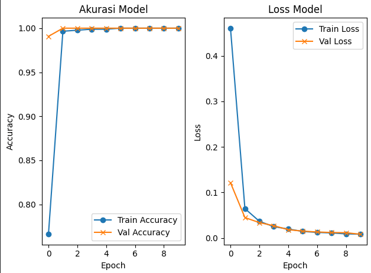
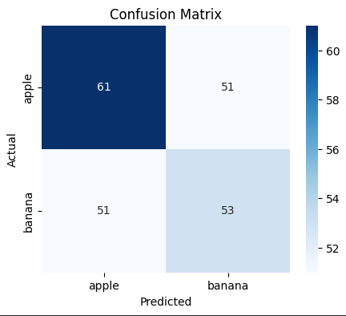

# 🍎🍌 Klasifikasi Gambar: Apel vs Pisang dengan Transfer Learning

Proyek ini menggunakan **Transfer Learning** dengan arsitektur **MobileNetV2** untuk mengklasifikasikan gambar ke dalam dua kategori: **apel** dan **pisang**. Kumpulan data terdiri dari gambar apel dan pisang segar dan busuk, yang telah diberi label ulang ke dalam dua kelas untuk penyederhanaan.

## 📁 Ringkasan Kumpulan Data

- **Sumber**: Kumpulan data kustom (dari 6 kelas asli)
- **Kelas yang Digunakan**:
- `freshapples`, `rottenapples` → **apple**
- `freshbanana`, `rottenbanana` → **banana**
- **Total Gambar**:
- Pelatihan: 868
- Validasi: 216

## ⚙️ Arsitektur Model

- Model Dasar: `MobileNetV2` (sudah dilatih, tanpa lapisan atas)
- Lapisan Tambahan:
- `GlobalAveragePooling2D`
- `Dense(2, activation='softmax')`
- Pengoptimal: `Adam`
- Kerugian: `categorical_crossentropy`
- Metrik: `accuracy`

## 📊 Hasil Pelatihan

- Epoch: 10
- Model mencapai hampir **100% akurasi** pada set pelatihan dan validasi.
- Namun, matriks kebingungan mengungkap kesalahan klasifikasi yang seimbang antara kedua kelas.

### Akurasi & Kerugian



### Matriks Kebingungan



## 📚 Libraries Used

The following Python libraries were used in this project:

- `TensorFlow` (including Keras) – deep learning framework
- `NumPy` – array operations
- `Matplotlib` – visualization of training history and confusion matrix
- `scikit-learn` – for confusion matrix and evaluation metrics
- `os` – for handling file system operations
- `shutil` – for file movement and organization
- `PIL (Pillow)` – image processing
- `random` – for data shuffling

To install the required libraries:
```bash
pip install tensorflow matplotlib scikit-learn pillow

